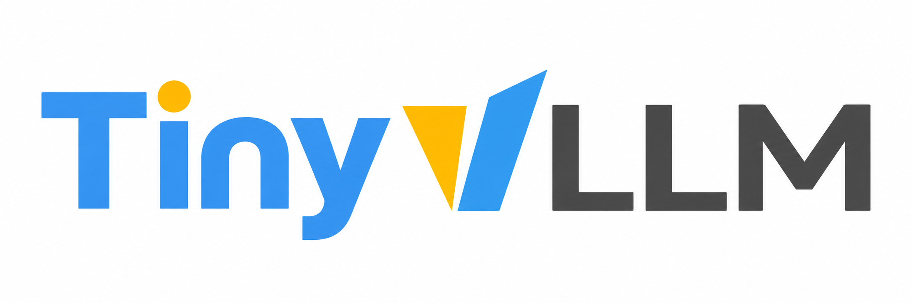

# TinyvLLM



[English](README.md) | [简体中文](README_zh.md)

基于 Nano-vLLM 的轻量级大模型推理引擎，用于学习推理流程和性能优化。

## 做了什么

- 支持 Qwen3-0.6B、Llama-3.2-1B-Instruct 和 MiniMind-3-MoE，加载预训练权重进行文本生成。
- **Unified Scheduling**：Prefill 和 Decode 共享 token 预算，可在同一批次执行。
- **Chunked Prefill**：长输入按预算分块处理，KV Cache 按需分配。
- 实现分页 KV Cache、Triton Flash Attention 和 Paged Attention；MiniMind 的 Prefill 使用 PyTorch SDPA。
- 支持多 GPU 张量并行和 CUDA Graph，提供注意力及推理吞吐量基准测试。

Unified Scheduling 和 Chunked Prefill 位于 `unified_scheduler` 分支，尚未合入当前分支。

## 运行方式

需要 Linux、NVIDIA GPU（CUDA）、Python 3.11 和 uv。

```bash
uv sync

# Qwen3 推理
uv run python main.py

# Llama 3.2 推理
uv run python main_llama32.py

# MiniMind-3-MoE 推理
uv run python main_minimind.py
```

在对应脚本的 `config` 中设置运行模式，修改后仍使用上面的命令启动：

| 配置                    | 运行模式                                |
| ----------------------- | --------------------------------------- |
| `world_size = 1`        | 单 GPU（默认）                          |
| `world_size = N`        | N 张 GPU 张量并行，由引擎自动启动子进程 |
| `enforce_eager = True`  | Eager 执行（默认）                      |
| `enforce_eager = False` | Decode 阶段使用 CUDA Graph              |

`unified_scheduler` 分支默认启用统一调度和分块预填充；`max_num_batched_tokens` 控制每轮总预算，`long_prefill_token_threshold` 控制单请求每轮 token 上限（0 表示不额外限制）。

## 性能测试

```bash
# Prefill 注意力性能对比
uv run python benchmark_prefilling.py

# Decode 注意力性能对比
uv run python benchmark_decoding.py

# TinyvLLM、vLLM、Transformers 吞吐量对比
uv run python benchmark_tps.py
```
